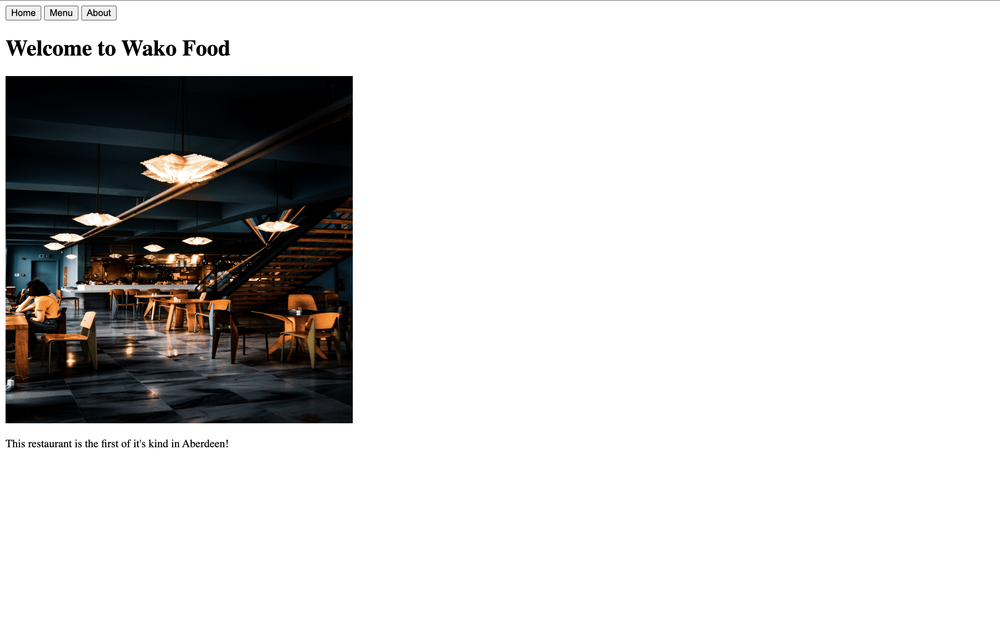

# Restaurant Page

A dynamic restaurant website built with JavaScript and Webpack. This project demonstrates the use of modern JavaScript practices including:

- Module bundling with Webpack
- Dynamic DOM manipulation
- Tab-based navigation
- CSS styling

## Features

- Responsive design
- Dynamic content loading
- Interactive navigation
- Modern UI/UX



## Live Demo

[View the live site](https://wakodono.github.io/restaurant-page)

## Technologies Used

- JavaScript
- Webpack
- HTML5
- CSS3

## Installation

1. Clone the repository

```bash
git clone https://github.com/Wakodono/restaurant-page.git
```

2. Install dependencies

```bash
npm install
```

3. Run development server

```bash
npm run dev
```

## Usage

- Click on the navigation tabs to switch between different sections
- Each section (Home, Menu, About) loads dynamically
- The active tab is highlighted for better user experience

## Project Structure

```
restaurant-page/
├── src/
│   ├── index.js
│   ├── home.js
│   ├── menu.js
│   ├── about.js
│   ├── initial-load.js
│   ├── template.html
│   └── styles.css
├── dist/
├── webpack.config.js
└── package.json
```

## License

ISC
